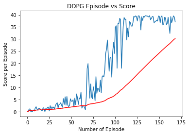
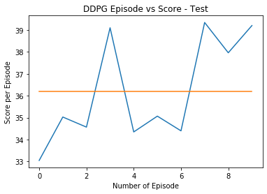

# Deep Reinforcement Learning Nanodegree

## Continuous Control - Train an RL agent to move a robotic arm

Environment consist of a double-jointed arm can move to target locations. A reward of **+0.1** is provided for each step that the **agent's hand** is in the **goal location**. The goal of your agent is to maintain its position at the target location for as many time steps as possible.

To solve the environment, agent must achieve an **average score of +30 over 100 consecutive episodes**.


### Evaluate State & Action Space

The observation space consists of 33 variables corresponding to position, rotation, velocity, and angular velocities of the arm. Each **action** is a vector with **four numbers**, corresponding to **torque applicable to two joints**. Every entry in the action vector should be a number between -1 and 1.

### Getting Started

Download the environment from one of the links below. You need only select the environment that matches your operating system:

- Linux: [click here](https://s3-us-west-1.amazonaws.com/udacity-drlnd/P2/Reacher/one_agent/Reacher_Linux.zip)
- Mac OSX: [click here](https://s3-us-west-1.amazonaws.com/udacity-drlnd/P2/Reacher/one_agent/Reacher.app.zip)
- Windows (64-bit): [click here](https://s3-us-west-1.amazonaws.com/udacity-drlnd/P2/Reacher/one_agent/Reacher_Windows_x86_64.zip)

Install the python with the required virtual environment to execute the jupyter notebook using `requirement.txt`.

Follow the instructions in `Continuous_Control.ipynb` to get started with training or execution of the trained agent.

### Algorithm - Deep Deterministic Policy Gradient (DDPG)

A model-free, off-policy actor-critic algorithm using deep function approximators that can learn policies in high-dimensional, continuous action spaces.

Implementation of the algorithm can be seen in file `model.py` which contain three major part of Deep Deterministic Policy Gradient as mentioned below:

- Actor-Critic methods - To leverage the strengths of both value-based and policy-based methods.
- Ornstein-Uhlenbeck process - To systematically manage the exploration vs. exploitation trade-off.
- Experience replay - To randomly sample data, so that the it become uncorrelated.

### Implementation Result

Actor and Critic networks have simple model with two fully-connected hidden layers of 128 units, which worked well after some trial-and-error of hypyerparametes (hidden layers, buffer size, gamma, learning rate, sigma, and other).

```python
# hyperparametes
BUFFER_SIZE = int(1e5)       # replay buffer size
BATCH_SIZE = 256             # minibatch size
GAMMA = 0.90                 # discount factor
TAU = 1e-3                   # for soft update of target parameters
LR_ACTOR = 1e-3              # learning rate of the actor 
LR_CRITIC = 1e-3             # learning rate of the critic
WEIGHT_DECAY = 1e-6          # L2 weight decay
SIGMA = 0.1                  # volatility parameter
HIDDEN_UNIT = 128            # number of units in hidden layer
```



Agent were able to solve the environment is 169 steps with and average reward of 30+ over 100 consecutive episodes. Test result of the agent on fresh environment for 10 episode is shown below.



### Future Improvements

This is start and there is plenty of space for improvement as we can see from the training/test result and few other things which I noticed in unity environment simulation during training of the agent.

- To check and understand how agent will perform when tranined using on-policy methods.
- Optimization of neural network architecture of the agent in more compact form and with less hidden layer size.
- Using priority buffer can also help in the converging the neural network faster with more stable training.